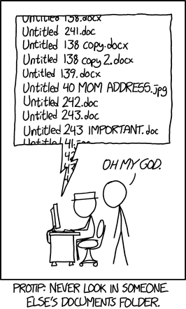
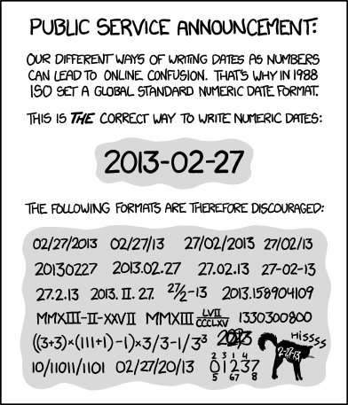
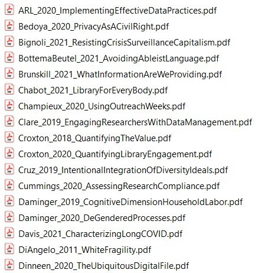
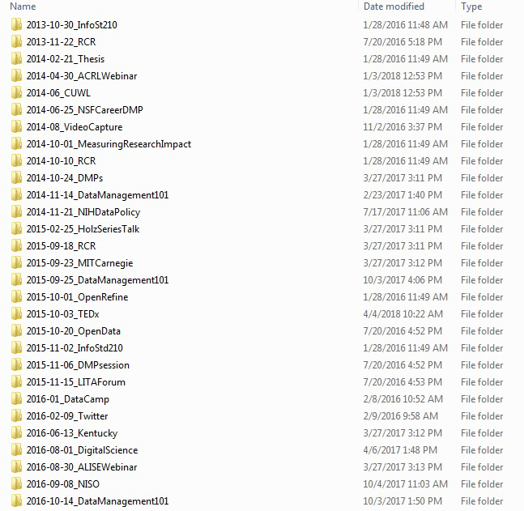

:::::::::::::::::::::::::::::::::::::: questions 

- What is the best file organization scheme for you?
- What is the best file naming convention for you?

::::::::::::::::::::::::::::::::::::::::::::::::

::::::::::::::::::::::::::::::::::::: objectives

- Determine how to create and implement a file organization scheme.
- Understand what some common file naming conventions are.
- Implement a file naming convention scheme for yourself.

::::::::::::::::::::::::::::::::::::::::::::::::

## Introduction

Implementing a file organization system is the first step toward
creating order for your research data. Well-organized files make it easier to find
the data you need without spending lots of time searching your computer. Every
researcher organizes their files slightly differently, but the actual organizational
system is less important that having a place where all of your files should logically
go. 

::::::::::::::::::::::::::::::::::::: challenge 

## Card Sorting Exercise

This is a card-sorting exercise, meaning you will need a stack
of note cards or post-it notes to do this activity, ideally in three different colors.
There is no one correct way to do this so feel free to play around, add new cards, and 
move cards however you want! Once you put your new organizational system into place, be 
sure to always put your files where they’re supposed to go.

1. Take a stack of note cards or post-it notes in the first color and write the
following labels on one card each, omitting any file types that you do not
use in your research:
   - Raw data
   - Analyzed data
   - Code
   - Protocols
   - Article drafts
   - Figures
   - My publications
   - Literature PDFs
   - Grant documents
   - Research notes

2. Move cards around and group together file-type cards that you want to
store together. Files that will be stored near each other in a folder hierarchy,
but not together, should be placed near each other while file types
expected to be stored completely separately should be away from other
cards.

3. Create hierarchies in file organization by adding new “folder” cards in one
of two types; use different colored cards for each folder type:
   - Cards in the second color represent a single folder. These should be
labeled with the folder name in quotations (e.g. “Literature” or “My
publications”).
   - Cards in the third color represent a group of folders, such as for
folders organized by date or by project. Use only one card to represent
the organizational pattern that will be repeated. These cards should be 
labeled with the organizational system in square brackets (e.g. [By date] or 
[By project]). Note: folders organized by date should, in real life, be 
labelled using the convention YYYYMMDD or YYYY-MM-DD to facilitate chronological 
sorting.

4. Move existing file-type cards/groups of file-type cards underneath the new
folder cards to show the hierarchy of how a file type will be saved in a
specific folder or group of folders. Organizational-group folders (cards in
the third color) only need to be represented once in the card sorting, as
they are assumed to represent multiple folders on a computer.

5. Make copies of any type of card and add folder levels, as needed. Adjust
placement and hierarchies until you are happy with the organizational
system you developed.

6. Record your organizational system in your lab notebook and/or a
README.txt.

::::::::::::::::::::::::

:::::::::::::::::::::::: solution

## Example Card Layout

{alt="example postit exercise solution"}

:::::::::::::::::::::::::::::::::

## Create a File Naming Convention

{alt="How not to name your files"}

File naming conventions are a simple way to add order to your
files and help to find them later. Rich and descriptive file names make it easier
to search for files, understand at a glance what they contain, and tell related
files apart. When creating a file naming convention, consider:

- The group of files covered by the convention.
- Important metadata that distinguishes files.
- Abbreviation or encoding of metadata.
- The order of metadata in the file name (prioritize date in ISO 8601 format for chronological sorting).
- Characters for separating metadata (use underscores, dashes, and capitalization).
- Version control (append version information or date).
- Documentation of the naming convention in a README.txt file.

::::::::::::::::::::::::::::::::::::: callout

## Concerning Date Formats

{alt="Correct date format comic"}

Indeed, ISO 8601 is an international standard that discusses date and time-related data. More information can
be found on the corresponding [wikepedia page](https://en.wikipedia.org/wiki/ISO_8601).

:::::::::::::::::::::::::::::::::::::

::::::::::::::::::::::::::::::::::::: challenge

## File nameing Convention Exercise

Fill in each section for a group of related files following the
instructions; an example for microscopy files is provided. This exercise may be
redone as needed, as different groups of files require different naming conventions.

***1. What group of files will this naming convention cover?***
You can use different conventions for different file sets.

Example: This convention will apply to all of my microscopy files, from raw
image through processed image.

***2. What information (metadata) is important about these files and makes each file distinct? ***
Ideally, pick three pieces of metadata; use no more than five. This metadata
should be enough for you to visually scan the file names and easily understand what’s in each one.

Example: For my images, I want to know date, sample ID, and image number for that sample on that date.

1.
2.
3.
4.
5.

***3. Do you need to abbreviate any of the metadata or encode it?***
If any of the metadata from step 2 is described by lots of text, decide what
shortened information to keep. If any of the metadata from step 2 has regular
categories, standardize the categories and/or replace them with 2- or 3-letter
codes; be sure to document these codes.

Example: Sample ID will use a code made up of: a 2-letter project abbreviation
(project 1 = P1, project 2 = P2); a 3-letter species abbreviation (mouse =
“MUS”, fruit fly = “DRS”); and 3-digit sample ID (assigned in my notebook).

***4. What is the order for the metadata in the file name?***
Think about how you want to sort and search for your files to decide what metadata
should appear at the beginning of the file name. If date is important, use
ISO 8601-formatted dates (YYYYMMDD or YYYY-MM-DD) at the beginning
of the file names so dates sort chronologically.

Example: My sample ID is most important so I will list it first, followed by date,
then image number.

1.
2.
3.
4.
5.

***5. What characters will you use to separate each piece of metadata
in the file name?***
Many computer systems cannot handle spaces in file names. To make file names
both computer- and human-readable, use dashes (-), underscores (_), and/or
capitalize the first letter of each word in the file names. A good convention is to
use underscores to separate unrelated pieces of metadata and dashes to separate
related pieces of metadata for parsing and readability.

Example: I will use underscores to separate metadata and dashes between parts
of my sample ID.

***7. Write down your naming convention pattern.***
Make sure the convention only uses alphanumeric characters, dashes, and underscores.
Ideally, file names will be 32 characters or less.

Example: My file naming convention is “SA-MPL-EID_YYYYMMDD_###_status.tif”
Examples are “P1-MUS-023_20200229_051_raw.tif” and “P2-DRS-
285_20191031_062_composite.tif”.

***8. Document this convention in a README.txt (or save this worksheet)
and keep it with your files.***

:::::::::::::::::::::::::::::::::::::

::::::::::::::::::::::::::::::::::::: solution

## Example Naming conventions

{alt="Example file naming convention"}

{alt="Example folder naming convention"}

:::::::::::::::::::::::::::::::::::::

### Simple version control

There is a plethora of version control systems for files, with the most popular being [Git](https://git-scm.com/) used
with [Microsoft's github](https://github.com/). For simple file version control, the following scheme could be used:

- File version numbers
   - mydata_v01.csv
   - mydata_v02.csv
   - mydata_v03.csv
   - mydata_FINAL.csv
- Files with dates
   - myprotocol_2022-12-13.txt
   - myprotocol_2023-01-07.txt
   - myprotocol_2023-03-25.txt

::::::::::::::::::::::::::::::::::::: keypoints 

## Keypoints

### File Organization

- Outline an organizational structure that fits your files
   - Any structure is better than none
   - Make your structure logical for your data
   - Work out a structure with your collaborators
- Get in the habit of putting things where they belong

### File Naming Conventions 

- Rich in descriptive information (metadata)
- Help organize files
- Enable easy search
   - Visually scan files quickly
   - Disambiguate related files
   - Perform system searches
- Enhance computability

::::::::::::::::::::::::::::::::::::::::::::::::

